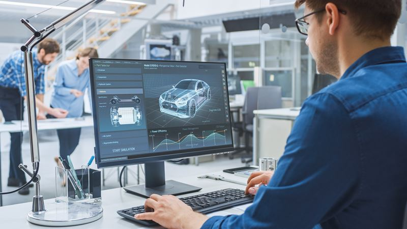
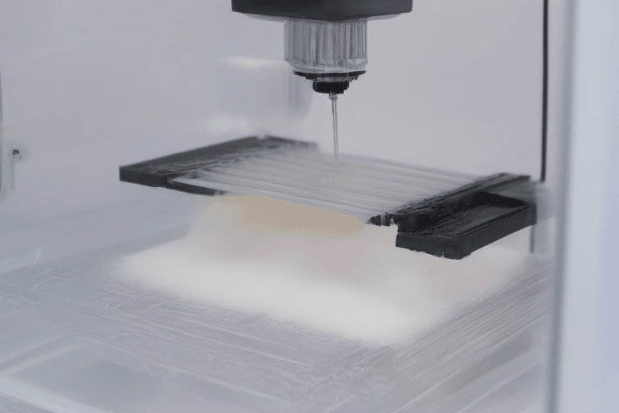
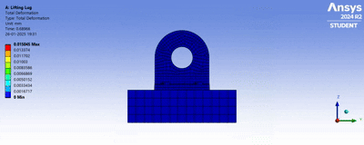
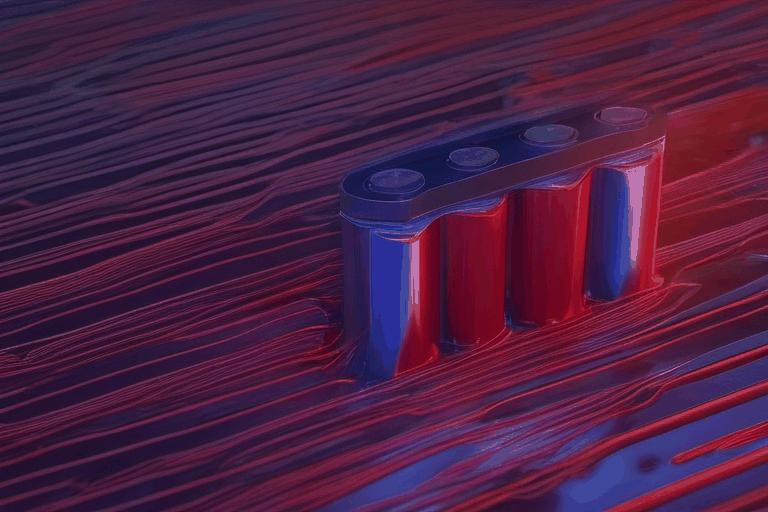
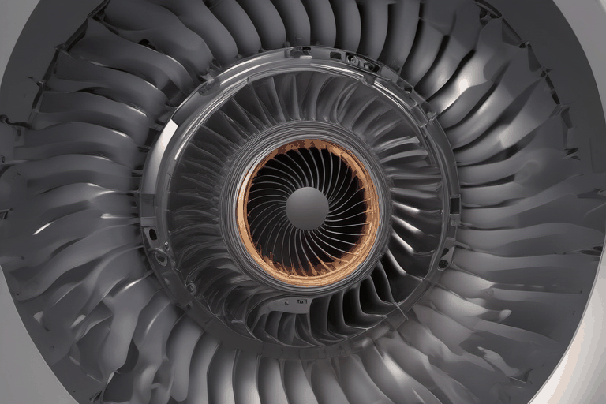

<!-- Profile Image -->

  

<h1 align="center">Hi, I'm Dipendu Mondal👋</h1>
<h3 align="center">🚀 Mechanical Engineer   🖥️ Computer-Aided Design (CAD)   🛠️ Computer-Aided Manufacturing   🏗️ Structural Analyst   🤖 Robotics & IoT   📊 Data-Driven Engineering </h3>

  
  
  

---

### 👨🏽‍🔬 About Me

-🎓 3rd Year B.Tech in Mechanical Engineering, IIEST Shibpur 
-🤖 Focused on Design, Analysis, Robotics & Automation 
-🚀 Internships & projects in Power Plant Systems and Additive Manufacturing 
-🛠️ Skilled in ANSYS, SolidWorks, MATLAB, Simulink, ROS, PyBullet, Isaac Sim 
-📊 Strong interest in Data-Driven Engineering, Optimization, and Physics-based Modeling 
-🏆 Winner of CADathon (Design Competition) and active member of IMechE, SAE, SME societies 

---

### 🧠 Tech Profile

| Property                  | Data                                                                 |
|---------------------------|----------------------------------------------------------------------|
| **CAD**                   | Solidwork,Fusion,AutoCad,Catia                                       |
| **CAE**                   | Ansys, Fusion, MATLAB, Solidwork Simulation, ROS tools               |
| **CAM**                   | UltiMaker Cura, Fusion CAM,ToolPath                                  |
| **Domain Knowledge**      | Robotics, Additive Manufacturing, CNC Machining                      |
| **Tools & Infra**         | Git, Docker, Latex                                                   |
| **Language**              | Matlab,SQL,Python(basic),C                                           |

---

### 🛠️ Skills & Tools

---

#### 🧠 Insane F1 Engineering 

####  3D Printing (AM)

####  Structural Analysis

#### 🔋 Battery Thermal Management System (CFD)

#### 🤖 Robotic Arm Simulation (3-DOF / 6-DOF)

#### 🌀 GEnX (Boeing 787)

---

### 🚀 Project

| Project | Description |
|--------|-------------|
| 🔧 **G-code to APT code** | Sensor network using ESP32, MQTT, WebSockets, and Grafana for predictive maintenance. |
| 🤖 **Battery Thermal Management System** | Real-time robotic arm with camera + computer vision using Blender and Isaac Sim. |
| 🌐 **Structural Analysis of Lifting Lug** | Hybrid classical-quantum classifiers for engineering datasets using Pennylane. |
| 📈 **3DOF/6DOF Robotic Arm** | Visualize multi-node sensor data for anomaly detection. |
| 🔭 **3d Printer Optimization** | Synced digital-physical robotic system with simulation feedback loop. |

---

### 🌍 Now

- 📚 Reading: *“Quantum Computation and Quantum Information” by Nielsen & Chuang*  
- 🔭 Building: Real-time sorting robot with computer vision & ML feedback  
- 💡 Learning: Advanced robotics control | Reinforcement Learning | ROS2 & Gazebo Sim  
- 🧠 Exploring: Self-supervised learning in robotic perception

---

### ✨ GitHub Stats

  
  

---

### 📫 Let's Connect

- ✉️ Email: **dipendumondal6296@gmail.com**
- 🔗 LinkedIn: [https://www.linkedin.com/in/dipendu-mondal-8281b6286/](https://www.linkedin.com/in/dipendu-mondal-8281b6286/)
- 💡 Quote:  
  > "Engineering is the art of directing the great sources of power in nature for the use and convenience of man."  
  — Thomas Tredgold

---

  

